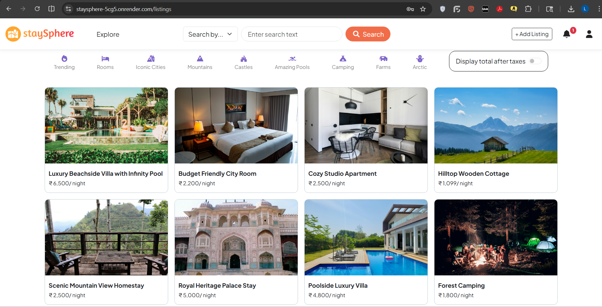
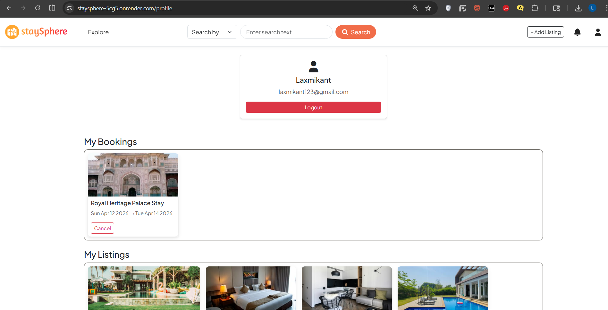
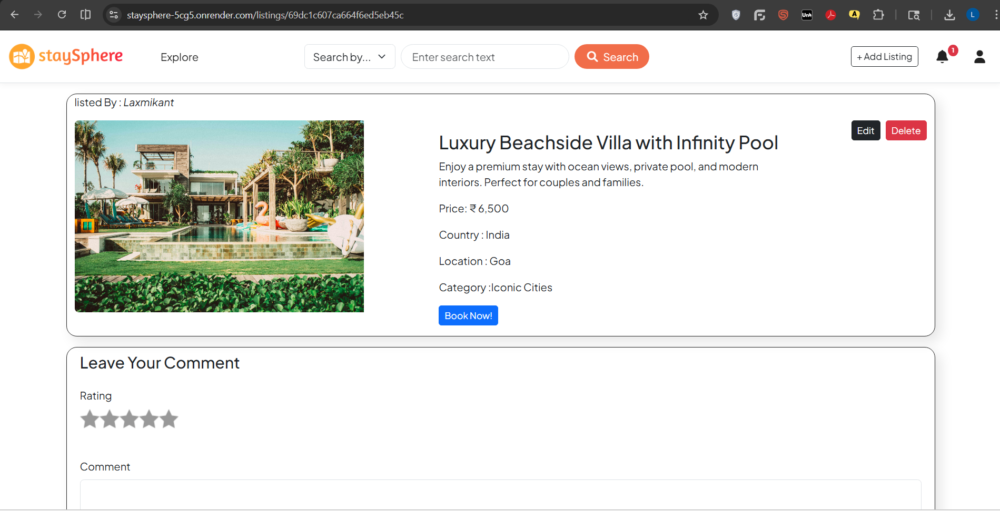
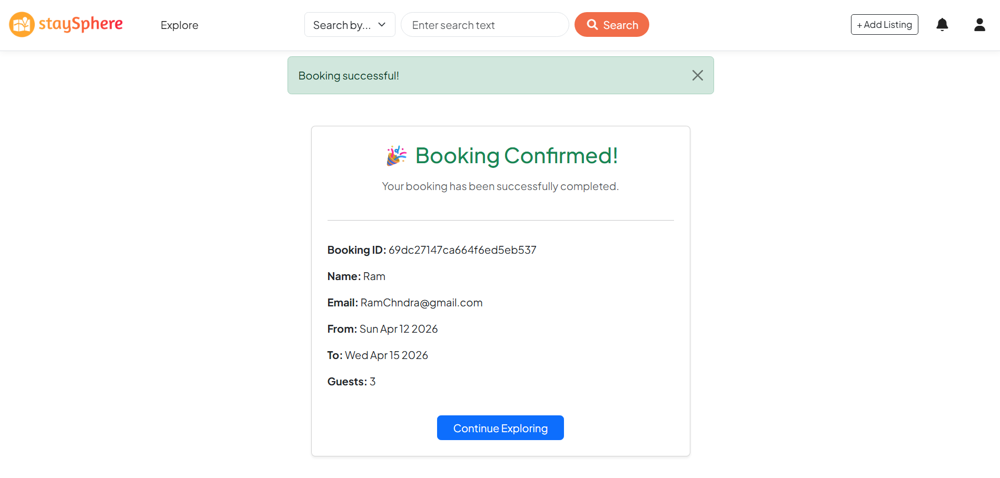

# 🏡 StaySphere

StaySphere is a full-stack web application that allows users to discover, list, and book unique stays such as villas, rooms, farmhouses, and more.

---

## 🚀 Live Demo
👉 https://staysphere-5cg5.onrender.com

---

## 📌 Features

### 🔐 Authentication
- User signup & login
- Session-based authentication using Passport.js

### 🏠 Listings
- Create, edit, and delete listings
- Upload images (Cloudinary integration)
- Categorized listings (Trending, Rooms, Mountains, etc.)

### 🔎 Search & Filters
- Search listings by title, city, or country
- Category-based filtering system

### 📅 Booking System
- Book listings with date selection
- Cancel bookings
- Booking status management (confirmed / cancelled)

### 🔔 Notifications
- Owners get notified when their listing is booked
- Unread notification counter in navbar
- Mark notifications as read

### 👤 User Profile
- View personal info
- See own listings
- View bookings
- Cancel bookings

### ⭐ Reviews
- Add reviews with ratings
- Delete own reviews

### 🗺 Map Integration
- Mapbox integration to show listing location

---

## 🛠 Tech Stack

### Frontend
- EJS (Embedded JavaScript Templates)
- Bootstrap 5
- CSS

### Backend
- Node.js
- Express.js

### Database
- MongoDB
- Mongoose

### Other Tools
- Cloudinary (Image upload)
- Mapbox (Maps)
- Passport.js (Authentication)
- Joi (Validation)

---

## 📸 Screenshots

### 🏠 Home Page


### 👤 Profile Page


###   📄 Listing View Page


### 📅 Booking 


---

## ⚙️ Installation (Local Setup)

```bash
git clone https://github.com/laxmikant-jawadwar/staySphere.git
cd staysphere
npm install 

```

### Create `.env` file:

```env
CLOUDINARY_CLOUD_NAME=your_cloud_name
CLOUDINARY_KEY=your_key
CLOUDINARY_SECRET=your_secret

MAP_TOKEN=your_mapbox_token

DB_URL=your_mongodb_url
SECRET=session_secret

```
### Run the app:

```bash
node app.js
```

###Visit

http://localhost:8080

---

## 📂 Project Structure

📦 staySphere
 ┣ 📂 controllers
 ┣ 📂 models
 ┣ 📂 routes
 ┣ 📂 views
 ┣ 📂 public
 ┣ 📂 utils
 ┣ 📂 init
 ┣ 📜 middleware.js
 ┣ 📜 schema.js
 ┣ 📜 cloudConfig.js
 ┣ 📜 app.js
 ┣ 📜 package.json
 ┗ 📜 README.md

---
## 🎯 Future Improvements

- Wishlist / Favorites ❤️
- Payment integration 💳
- Chat system between users 💬
- Advanced filtering (price, rating)
---
## 👨‍💻 Author

*Laxmikant Jawadwar*

- LinkedIn: https://www.linkedin.com/in/laksh-jawadwar
- GitHub: https://github.com/laxmikant-jawadwar